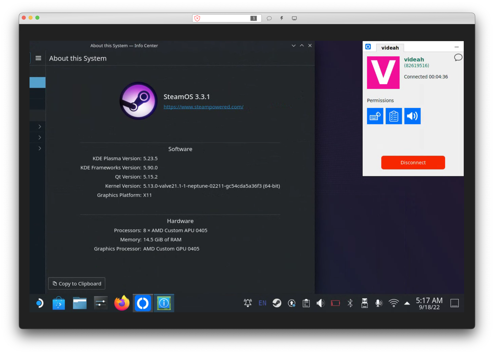

# steamdeck-rustdesk



This repo holds notes and a script used to get [RustDesk](https://github.com/rustdesk/rustdesk)
working on the Steam Deck using `systemd-sysext` to avoid breaking SteamOS's read-only seal.
*Theoretically* this setup should survive system updates, but I haven't done enough testing
to make sure that's really the case.

A lot of this was based on [Xe's blog post about running Tailscale on Steam Deck](https://tailscale.com/blog/steam-deck),
which is where I learned about the existence of `systemd-sysext`

# Things To Note

### Only works in Desktop mode with X11, Wayland isn't supported
RustDesk is only useful for controlling the Deck in Desktop mode. It's not useful for playing games.
Steam's built in streaming is much more useful for that.

### The latest version of RustDesk isn't supported
SteamOS currently uses an older version of glibc which RustDesk is dependent. At the time of writing
this README, the latest version 1.1.9 will not run. I'm not sure when this is likely to be fixed as
latest glibc versions cause issues with anticheats in games which is likely why Valve are holding it back.

There is always the option of compiling RustDesk yourself with the required glibc, but that's outside
the scope of this repo.

### It doesn't really work unattended
I have found that RustDesk's service needs to be restarted whenever switching
to Desktop Mode to get it to accept connections. This can be done over SSH,
but it is a bit annoying.  Seems to be related [to this issue.](https://github.com/rustdesk/rustdesk/issues/440)

# Install
RustDesk needs xauth to be setup to work. It doesn't seem to be by default.

If .Xauthority doesn't exist in your home directory already, run the following commands in a terminal **on your Steam Deck itself, not through SSH.**
This is because $DISPLAY needs to be set. The rest of the install can be done mostly through SSH.
```shell
touch ~/.Xauthority
xauth generate :0 . trusted
xauth add ${HOST}:0 . $(xxd -l 16 -p /dev/urandom)
```

Clone this repo onto your Steam Deck and run the included script as root.
```shell
sudo bash ./install-rustdesk-extension.sh
```

Once the script has finished installing things where it needs to run these commands to load and enable the extension:
```
sudo systemd-sysext refresh
sudo systemctl daemon-reload
sudo systemctl enable rustdesk
sudo systemctl start rustdesk
```

Now run `rustdesk` directly in a terminal on your Steam Deck in Desktop Mode. Note down your ID and password. You
only need to do this once.

You should now be able to connect to and control your Deck from another device using the ID and password you just noted down.

**Note:** As mentioned above in the notes, you may have to run `sudo systemctl restart rustdesk` whenever you switch
to Desktop Mode to get RustDesk to accept connections. Seems to be related [to this issue.](https://github.com/rustdesk/rustdesk/issues/440)